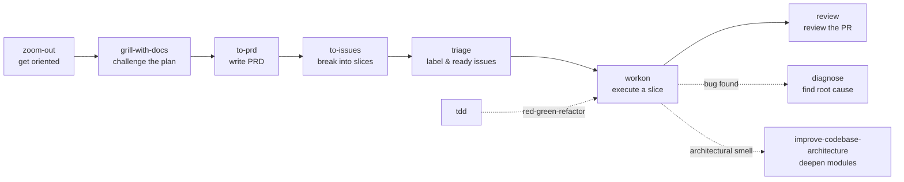

# Engineering skills

Skills for code work — bug-hunting, design, planning, review, and execution.

## Skills

- **[diagnose](./diagnose/README.md)** — Disciplined diagnosis loop for hard bugs and performance regressions: reproduce → minimise → hypothesise → instrument → fix → regression-test.
- **[grill-with-docs](./grill-with-docs/README.md)** — Code-aware grilling session that challenges your plan against the existing domain model and updates `CONTEXT.md` / ADRs inline.
- **[improve-codebase-architecture](./improve-codebase-architecture/README.md)** — Surface architectural friction and propose deepening opportunities — refactors that turn shallow modules into deep ones.
- **[review](./review/README.md)** — Read-only, high-signal pull request review using PR description, ticket scope, full diff context, and PR-suggested tests. Returns Critical / Suggestions / Nits.
- **[tdd](./tdd/README.md)** — Test-driven development with a red-green-refactor loop. Vertical slices via tracer bullets — one test, one implementation, repeat.
- **[to-issues](./to-issues/README.md)** — Break a plan, spec, or PRD into independently-grabbable issues using tracer-bullet vertical slices.
- **[to-prd](./to-prd/README.md)** — Turn the current conversation context into a PRD and publish it to the project issue tracker.
- **[triage](./triage/README.md)** — Move issues through a small state machine of triage roles (`needs-triage`, `needs-info`, `ready-for-agent`, `ready-for-human`, `wontfix`).
- **[workon](./workon/README.md)** — Pick up a Linear ticket end-to-end: worktree, implement, PR, then watch the PR on a 5-minute loop addressing review comments, CI failures, and merge conflicts until merged.
- **[zoom-out](./zoom-out/README.md)** — Tell the agent to zoom out and give a higher-level perspective on an unfamiliar section of code.

## How they fit together

Use them à la carte — there's no enforced pipeline.

## Attribution

Most engineering skills are ported from
[mattpocock/skills](https://github.com/mattpocock/skills) under MIT —
`workon` and `review` are dotbrains originals. See
[THIRD_PARTY_LICENSES.md](../../THIRD_PARTY_LICENSES.md) for full attribution.
