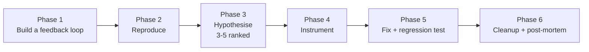

# /diagnose

Disciplined diagnosis loop for hard bugs and performance regressions:
**reproduce → minimise → hypothesise → instrument → fix → regression-test**.

The skill is opinionated about the order, and especially about *how much* effort
to spend on building a fast, deterministic feedback loop before doing any
actual debugging.

## Flow



## Install

```bash
npx skills@latest add dotbrains/skills
```

Or copy just this skill:

```bash
mkdir -p ~/.claude/skills/diagnose
curl -fsSL https://raw.githubusercontent.com/dotbrains/skills/main/skills/engineering/diagnose/SKILL.md \
  -o ~/.claude/skills/diagnose/SKILL.md
```

## Usage

Trigger naturally — "diagnose this", "debug this", or any concrete bug report.
The skill auto-applies when something is broken, throwing, or failing.

## Files

- [`SKILL.md`](./SKILL.md) — canonical skill definition.
- [`scripts/hitl-loop.template.sh`](./scripts/hitl-loop.template.sh) — bash template for human-in-the-loop reproduction loops.

## Attribution

Ported from [mattpocock/skills](https://github.com/mattpocock/skills/tree/main/skills/engineering/diagnose) under MIT. See [THIRD_PARTY_LICENSES.md](../../../THIRD_PARTY_LICENSES.md).
