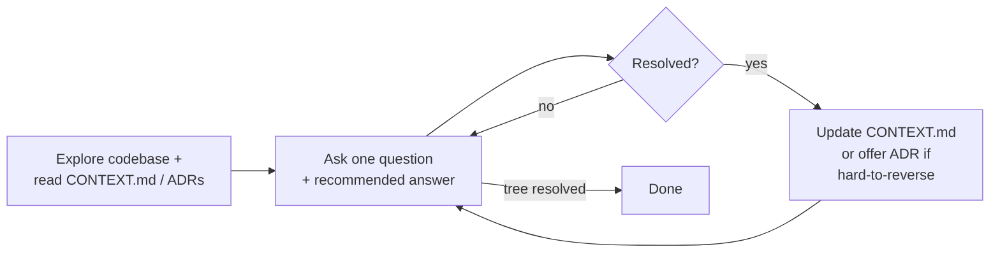

# /grill-with-docs

Code-aware grilling session. Same one-question-at-a-time interview as
[`/grill-me`](../../productivity/grill-me/README.md), but layered on top of
the project's domain glossary (`CONTEXT.md`) and architectural decisions
(`docs/adr/`). The skill **updates those docs inline** as decisions
crystallise — sharper terminology, fewer "wait, what does X mean here?"
moments later.

## Flow



## Documentation it maintains

- **`CONTEXT.md`** — the project's domain glossary. Created lazily when the
  first term is resolved. See [`CONTEXT-FORMAT.md`](./CONTEXT-FORMAT.md).
- **`docs/adr/NNNN-slug.md`** — Architecture Decision Records. Offered only
  when the decision is hard-to-reverse, surprising-without-context, AND a
  real trade-off. See [`ADR-FORMAT.md`](./ADR-FORMAT.md).
- **`CONTEXT-MAP.md`** (multi-context repos) — a top-level map pointing to
  per-context `CONTEXT.md` files. The skill auto-detects single vs.
  multi-context layout.

## What the skill challenges you on

- **Glossary conflicts.** "Your glossary defines 'cancellation' as X, but you seem to mean Y — which is it?"
- **Fuzzy language.** "You're saying 'account' — do you mean Customer or User? They're different things."
- **Code-vs-claim contradictions.** "Your code cancels entire Orders, but you just said partial cancellation is possible — which is right?"
- **Edge-case scenarios** invented to probe the boundary between concepts.

## Install

```bash
npx skills@latest add dotbrains/skills
```

Note: copying just `SKILL.md` will leave the `CONTEXT-FORMAT.md` /
`ADR-FORMAT.md` references dangling — prefer the `npx skills` flow so the
companion docs install too.

## Usage

Trigger by saying "grill me with docs", "stress-test this against the domain
model", or whenever you want documentation discipline applied during the
grilling.

For code-free grilling, use [`/grill-me`](../../productivity/grill-me/README.md).

## Files

- [`SKILL.md`](./SKILL.md) — canonical skill definition.
- [`CONTEXT-FORMAT.md`](./CONTEXT-FORMAT.md) — format and rules for `CONTEXT.md` / `CONTEXT-MAP.md`.
- [`ADR-FORMAT.md`](./ADR-FORMAT.md) — ADR template, when to offer one, and what qualifies.

## Attribution

Ported from [mattpocock/skills](https://github.com/mattpocock/skills/tree/main/skills/engineering/grill-with-docs) under MIT. See [THIRD_PARTY_LICENSES.md](../../../THIRD_PARTY_LICENSES.md).
