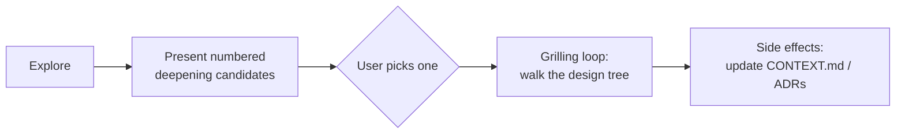

# /improve-codebase-architecture

Surface architectural friction and propose **deepening opportunities** —
refactors that turn shallow modules into deep ones, where a small interface
hides a lot of behavior.

## Vocabulary

The skill is strict about terminology — see [`LANGUAGE.md`](./LANGUAGE.md) for
the full glossary.

- **Module** — anything with an interface and an implementation.
- **Interface** — everything a caller must know.
- **Depth** — leverage at the interface.
- **Seam** — where an interface lives.
- **Adapter** — concrete thing satisfying an interface at a seam.

## Flow



## Key heuristic

The **deletion test**: imagine deleting the module. If complexity vanishes, it
was a pass-through. If complexity reappears across N callers, it was earning
its keep.

## Install

```bash
npx skills@latest add dotbrains/skills
```

## Caveat

The skill references `CONTEXT.md` (a domain glossary) and `docs/adr/` (ADRs)
that the upstream `grill-with-docs` skill is responsible for creating. Both
are also referenced but not ported here. The skill still runs without them —
it just won't have project-specific vocabulary to name candidates.

## Files

- [`SKILL.md`](./SKILL.md) — canonical skill definition.
- [`LANGUAGE.md`](./LANGUAGE.md) — vocabulary used in every suggestion.
- [`DEEPENING.md`](./DEEPENING.md) — how to deepen safely given a candidate's dependency category.
- [`INTERFACE-DESIGN.md`](./INTERFACE-DESIGN.md) — parallel sub-agent pattern for "design it twice".

## Attribution

Ported from [mattpocock/skills](https://github.com/mattpocock/skills/tree/main/skills/engineering/improve-codebase-architecture) under MIT. See [THIRD_PARTY_LICENSES.md](../../../THIRD_PARTY_LICENSES.md).
