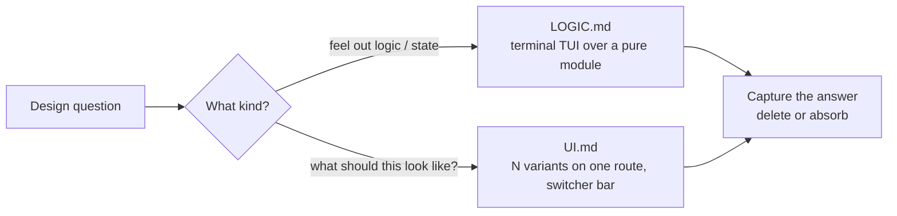

# /prototype

Build a **throwaway prototype** that answers a specific design question — then
delete it. Routes between two branches based on the question shape: a runnable
terminal app for state and business-logic questions, or several radically
different UI variations toggleable from one route.

## The branches



Picking the wrong branch wastes the whole prototype. When the question is
ambiguous and the user isn't around, default to whichever branch matches the
surrounding code (backend module → logic; page or component → UI) and state
the assumption at the top of the prototype.

## Rules that apply to both

- **Throwaway from day one** — locate near the eventual home, but name it so
  it's obviously not production.
- **One command to run** — use the project's existing task runner.
- **No persistence** — state in memory unless the question is about the
  database itself.
- **Skip the polish** — no tests, no extra error handling, no abstractions.
- **Surface the state** — render the full relevant state on every action or
  variant switch.
- **Delete or absorb when done** — capture the answer (commit, ADR, NOTES),
  then remove the prototype.

## Install

```bash
npx skills@latest add dotbrains/skills
```

Or copy just this skill (note: `prototype` references companion files, so
copying just `SKILL.md` will leave dangling links — prefer the npx flow):

```bash
mkdir -p ~/.claude/skills/prototype
curl -fsSL https://raw.githubusercontent.com/dotbrains/skills/main/skills/engineering/prototype/SKILL.md \
  -o ~/.claude/skills/prototype/SKILL.md
```

## Usage

Trigger when the user wants to sanity-check a data model or state machine
before committing to it, mock up a UI, or explore design options — "prototype
this", "let me play with it", "try a few designs".

## Files

- [`SKILL.md`](./SKILL.md) — canonical skill definition.
- [`LOGIC.md`](./LOGIC.md) — terminal TUI prototype over a pure logic module.
- [`UI.md`](./UI.md) — N radically-different UI variants on one route with a
  floating switcher bar.

## Attribution

Ported from [mattpocock/skills](https://github.com/mattpocock/skills/tree/main/skills/engineering/prototype) under MIT. See [THIRD_PARTY_LICENSES.md](../../../THIRD_PARTY_LICENSES.md).
