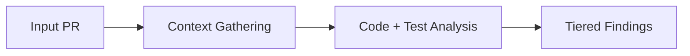
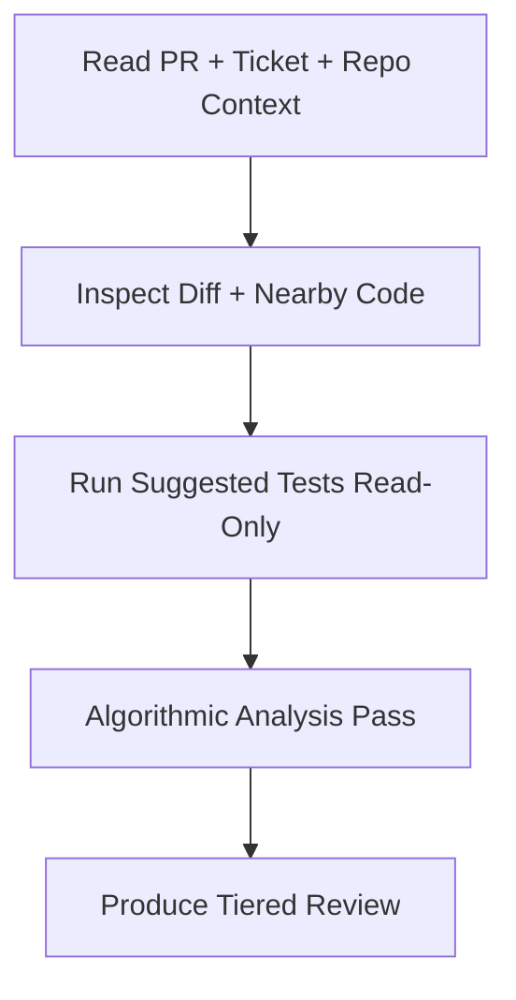

# /review

Portable `/review` skill for high-signal pull request review. Read-only by
default — never edits files, commits, pushes, or posts PR comments.

1. Read PR metadata and description.
2. Read the associated ticket to understand scope and intent.
3. Sweep repo docs (`CLAUDE.md`, `AGENTS.md`, `CONTRIBUTING.md`, `.cursor/rules/`, lint config) and surface relevant skills — establishes the baseline for "consistent with existing patterns" findings.
4. Analyze the diff plus surrounding code context.
5. Run PR-suggested tests in read-only mode.
6. Run an algorithmic analysis pass over the diff — informational time/space complexity check.
7. Produce a structured review with Critical / Suggestions / Nits / Algorithmic Analysis.

## Flow





## Install

Via the dotbrains skills CLI flow:

```bash
npx skills@latest add dotbrains/skills
```

Or copy just this skill:

```bash
mkdir -p ~/.claude/skills/review
curl -fsSL https://raw.githubusercontent.com/dotbrains/skills/main/skills/review/SKILL.md \
  -o ~/.claude/skills/review/SKILL.md
```

## Usage

Pass either a full PR URL or a PR number in the current repository:

```text
/review https://github.com/owner/repo/pull/123
```

```text
/review 123
```

## Output

The skill returns a fixed-section review:

- **Summary** — 3–6 bullets with explicit confidence (High / Medium / Low).
- **Critical** — must-fix issues (incorrect behavior, data loss, security,
  broken contracts).
- **Suggestions** — important but non-blocking improvements.
- **Nits** — minor polish only when worthwhile.
- **Algorithmic Analysis** — informational time/space complexity sweep over the diff. Heading shifts based on worst severity (`Optimization Opportunities Found` / `Minor Opportunities` / `Code Quality Good` / `No algorithmic code in diff`). Findings are non-blocking unless promoted into Critical or Suggestions per §6 of [`SKILL.md`](./SKILL.md).
- **Test Validation** — commands claimed vs. commands actually run.
- **Scope Alignment Check** — what matches scope, what's out of scope, what's
  missing.
- **Verdict** — exactly one of `APPROVE`, `APPROVE WITH SUGGESTIONS`, or
  `REQUEST CHANGES`.

## Requirements

- `gh` CLI authenticated against your GitHub host
- Access to the repository being reviewed
- A connected **Linear MCP server** if the PR links a Linear ticket — the skill always reads Linear via MCP (`mcp__*Linear__get_issue`, `mcp__*Linear__list_comments`), never the REST API. Without it, the review proceeds with PR-only scope and notes reduced certainty.

## Files

- [`SKILL.md`](./SKILL.md) — canonical skill definition consumed by the agent.

## Attribution

The algorithmic analysis pass is adapted from
[`dotbrains/ticketsmith` — `docs/algorithmic-analysis.md`](https://github.com/dotbrains/ticketsmith/blob/main/docs/algorithmic-analysis.md).
Both repos are dotbrains-owned under PolyForm Shield 1.0.0, so no third-party
license entry is required.
