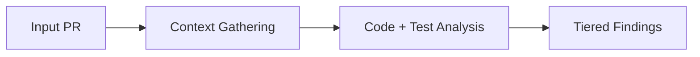
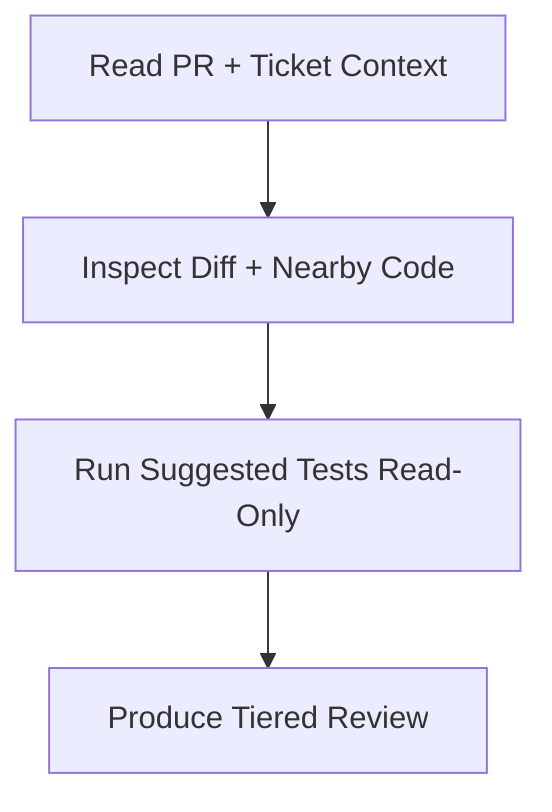

# /review

Portable `/review` skill for high-signal pull request review. Read-only by
default — never edits files, commits, pushes, or posts PR comments.

1. Read PR metadata and description.
2. Read the associated ticket to understand scope and intent.
3. Analyze the diff plus surrounding code context.
4. Run PR-suggested tests in read-only mode.
5. Produce a structured review with Critical / Suggestions / Nits.

## Flow





## Install

Via the dotbrains skills CLI flow:

```bash
npx skills@latest add dotbrains/skills
```

Or copy just this skill:

```bash
mkdir -p ~/.claude/skills/review
curl -fsSL https://raw.githubusercontent.com/dotbrains/skills/main/skills/review/SKILL.md \
  -o ~/.claude/skills/review/SKILL.md
```

## Usage

Pass either a full PR URL or a PR number in the current repository:

```text
/review https://github.com/owner/repo/pull/123
```

```text
/review 123
```

## Output

The skill returns a fixed-section review:

- **Summary** — 3–6 bullets with explicit confidence (High / Medium / Low).
- **Critical** — must-fix issues (incorrect behavior, data loss, security,
  broken contracts).
- **Suggestions** — important but non-blocking improvements.
- **Nits** — minor polish only when worthwhile.
- **Test Validation** — commands claimed vs. commands actually run.
- **Scope Alignment Check** — what matches scope, what's out of scope, what's
  missing.
- **Verdict** — exactly one of `APPROVE`, `APPROVE WITH SUGGESTIONS`, or
  `REQUEST CHANGES`.

## Requirements

- `gh` CLI authenticated against your GitHub host
- Access to the repository being reviewed
- Ticket system access if the PR links an external issue

## Files

- [`SKILL.md`](./SKILL.md) — canonical skill definition consumed by the agent.
