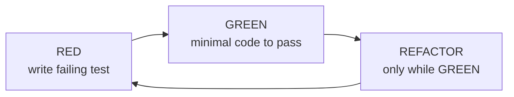

# /tdd

Test-driven development with a **red-green-refactor** loop. Vertical slices via
tracer bullets — one test, one implementation, repeat. Tests describe behavior
through public interfaces, not implementation details, so they survive
refactors.

## The loop



The skill is explicit that **horizontal slicing** — write all tests, then all
implementation — produces crap tests. Always go vertical.

## Install

```bash
npx skills@latest add dotbrains/skills
```

Or copy just this skill (note: `tdd` references companion files, so copying
just `SKILL.md` will leave dangling links — prefer the npx flow):

```bash
mkdir -p ~/.claude/skills/tdd
curl -fsSL https://raw.githubusercontent.com/dotbrains/skills/main/skills/engineering/tdd/SKILL.md \
  -o ~/.claude/skills/tdd/SKILL.md
```

## Usage

Trigger when starting a new feature or fixing a bug — "build this with TDD",
"red-green-refactor", "test-first".

## Files

- [`SKILL.md`](./SKILL.md) — canonical skill definition.
- [`tests.md`](./tests.md) — concrete examples of good vs. bad tests.
- [`mocking.md`](./mocking.md) — when to mock and how to design for mockability.
- [`deep-modules.md`](./deep-modules.md) — the deep-module pattern from *A Philosophy of Software Design*.
- [`interface-design.md`](./interface-design.md) — designing interfaces for testability.
- [`refactoring.md`](./refactoring.md) — refactor candidates after each cycle.

## Attribution

Ported from [mattpocock/skills](https://github.com/mattpocock/skills/tree/main/skills/engineering/tdd) under MIT. See [THIRD_PARTY_LICENSES.md](../../../THIRD_PARTY_LICENSES.md).
