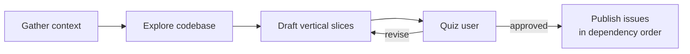

# /to-issues

Break a plan, spec, or PRD into independently-grabbable issues using
**tracer-bullet vertical slices**. Each slice cuts through every layer
(schema, API, UI, tests) so it's demoable on its own.

## Flow



Each slice is tagged **HITL** (needs human input) or **AFK** (agent-runnable
end-to-end). Prefer AFK.

## Install

```bash
npx skills@latest add dotbrains/skills
```

## Usage

Run after a plan/PRD is in conversation context. Optionally pass an existing
issue reference as the source.

## Caveat

This skill expects a configured issue tracker and triage label vocabulary.
Upstream `mattpocock/skills` ships a `setup-matt-pocock-skills` skill that
provides that config — it isn't ported here. Either install that skill
upstream or hand-configure your tracker before invoking `/to-issues`.

## Files

- [`SKILL.md`](./SKILL.md) — canonical skill definition.

## Attribution

Ported from [mattpocock/skills](https://github.com/mattpocock/skills/tree/main/skills/engineering/to-issues) under MIT. See [THIRD_PARTY_LICENSES.md](../../../THIRD_PARTY_LICENSES.md).
