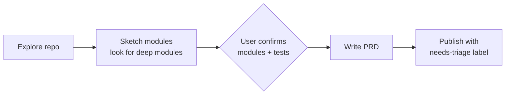

# /to-prd

Turn the current conversation context into a Product Requirements Document and
publish it to the project issue tracker. **No interview** — synthesizes from
what's already been discussed.

## Flow



## Install

```bash
npx skills@latest add dotbrains/skills
```

## PRD template

The skill emits a fixed-section PRD: Problem Statement, Solution, User Stories
(numbered, actor-benefit), Implementation Decisions, Testing Decisions, Out of
Scope, Further Notes.

## Caveat

Like `/to-issues`, this skill expects an issue tracker and triage label
vocabulary configured upstream. Hand-configure or install the upstream
`setup-matt-pocock-skills` skill before invoking.

## Files

- [`SKILL.md`](./SKILL.md) — canonical skill definition.

## Attribution

Ported from [mattpocock/skills](https://github.com/mattpocock/skills/tree/main/skills/engineering/to-prd) under MIT. See [THIRD_PARTY_LICENSES.md](../../../THIRD_PARTY_LICENSES.md).
