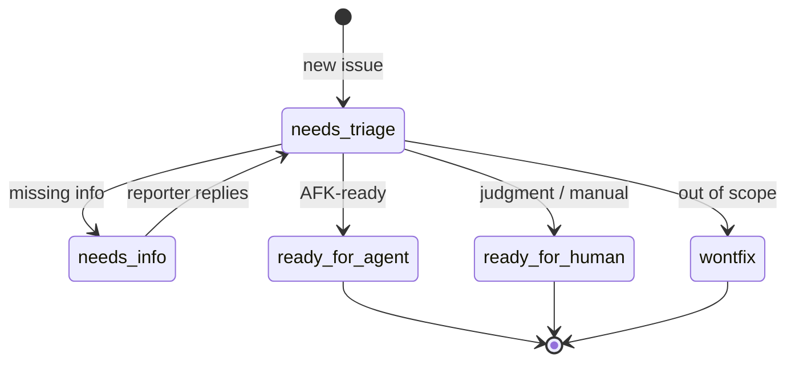

# /triage

Move issues through a small state machine of triage roles. Two **categories**
(`bug`, `enhancement`) × five **states** (`needs-triage`, `needs-info`,
`ready-for-agent`, `ready-for-human`, `wontfix`).

## State machine



Every triage comment must start with `> *This was generated by AI during triage.*`.

## Install

```bash
npx skills@latest add dotbrains/skills
```

## Usage

```text
/triage
```

Then describe what you want in natural language ("show me anything that needs
my attention", "let's look at #42", "move #42 to ready-for-agent").

## Caveat

Expects an issue tracker, triage label vocabulary, and an `.out-of-scope/`
knowledge base configured upstream. Hand-configure or install the upstream
`setup-matt-pocock-skills` skill before invoking. The companion grilling
skill ([`/grill-with-docs`](../grill-with-docs/README.md)) is referenced
during the "Grill" step and is included in this repo.

## Files

- [`SKILL.md`](./SKILL.md) — canonical skill definition.
- [`AGENT-BRIEF.md`](./AGENT-BRIEF.md) — how to write durable agent briefs.
- [`OUT-OF-SCOPE.md`](./OUT-OF-SCOPE.md) — how the `.out-of-scope/` knowledge base works.

## Attribution

Ported from [mattpocock/skills](https://github.com/mattpocock/skills/tree/main/skills/engineering/triage) under MIT. See [THIRD_PARTY_LICENSES.md](../../../THIRD_PARTY_LICENSES.md).
