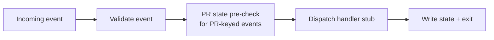

# /workon-event

Event-driven companion to `/workon`: handles one ticket event per invocation and exits.

- Reactive model (dispatcher-driven), no internal polling loop
- Strict event contract and validation
- Idempotent state handling with PR-state pre-check routing
- Scaffolded handlers for setup/watch/teardown events

## Lifecycle



## Install

```bash
npx skills@latest add dotbrains/skills
```

Or copy just this skill:

```bash
mkdir -p ~/.claude/skills/workon-event
curl -fsSL https://raw.githubusercontent.com/dotbrains/skills/main/skills/engineering/workon-event/SKILL.md \
  -o ~/.claude/skills/workon-event/SKILL.md
```

## Usage

This skill is typically invoked by an event dispatcher rather than manually.
The required arguments are:

```text
/workon-event <TICKET-ID> <EVENT-JSON>
```

## Requirements

- `gh` CLI authenticated for the target repository
- A connected Linear MCP server (for ticket-driven handlers)
- An external dispatcher that emits the event payloads described in `SKILL.md`

## Files

- [`SKILL.md`](./SKILL.md) — canonical skill definition.
