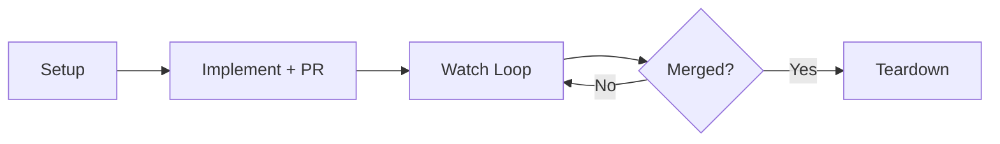
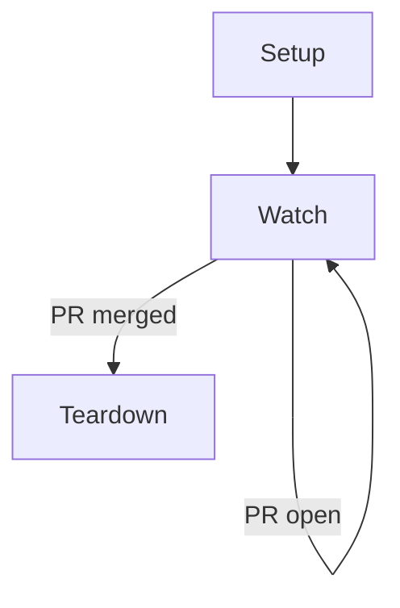

# /workon

Portable `/workon` skill for Linear-driven ticket execution: pick up a ticket
end-to-end, drive it from worktree creation through merge, and tear down
cleanly.

1. Create an isolated worktree.
2. Sweep repo docs (`CLAUDE.md`, `AGENTS.md`, `CONTRIBUTING.md`, `.cursor/rules/`, lint config) and surface relevant skills for the ticket's domain.
3. Implement and open a PR.
4. Watch PR health in a loop (AI review comments, CI, merge conflicts).
5. Tear down the worktree after merge.

## Lifecycle



The skill is **idempotent and stateful** — repeated invocations resume from the
current phase, with state cached in `~/.claude/workon/<TICKET-ID>.json` and
GitHub treated as the source of truth.



## Install

Via the dotbrains skills CLI flow:

```bash
npx skills@latest add dotbrains/skills
```

Or copy just this skill:

```bash
mkdir -p ~/.claude/skills/workon
curl -fsSL https://raw.githubusercontent.com/dotbrains/skills/main/skills/workon/SKILL.md \
  -o ~/.claude/skills/workon/SKILL.md
```

## Usage

```text
/workon ENG-66
```

The argument must match `[A-Z]+-\d+` (Linear-style ticket id). Re-running the
same invocation continues whatever phase the skill is in.

## Requirements

- `git`
- `gh` CLI authenticated against your GitHub host
- A connected **Linear MCP server** — the skill always uses MCP tools (e.g. `mcp__*Linear__get_issue`, `mcp__*Linear__save_comment`) for Linear reads and writes. If no Linear MCP is connected, the skill stops at §3.1 rather than falling back to the REST API.
- Loop scheduler support (for 5-minute watch ticks)

## Files

- [`SKILL.md`](./SKILL.md) — canonical skill definition consumed by the agent.
