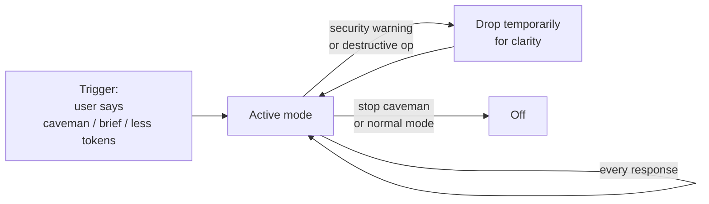

# /caveman

Ultra-compressed communication mode. Cuts token usage ~75% by dropping
filler, articles, and pleasantries while keeping full technical accuracy.

## How it works



Once activated, stays active across turns. Technical substance — code, errors,
exact terminology — is never abbreviated.

## Install

```bash
npx skills@latest add dotbrains/skills
```

Or copy just this skill:

```bash
mkdir -p ~/.claude/skills/caveman
curl -fsSL https://raw.githubusercontent.com/dotbrains/skills/main/skills/productivity/caveman/SKILL.md \
  -o ~/.claude/skills/caveman/SKILL.md
```

## Usage

Trigger by saying "caveman mode", "talk like caveman", "be brief", "less
tokens", or `/caveman`. Disable with "stop caveman" or "normal mode".

## Files

- [`SKILL.md`](./SKILL.md) — canonical skill definition.

## Attribution

Ported from [mattpocock/skills](https://github.com/mattpocock/skills/tree/main/skills/productivity/caveman) under MIT. See [THIRD_PARTY_LICENSES.md](../../../THIRD_PARTY_LICENSES.md).
