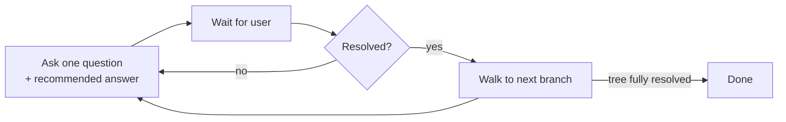

# /grill-me

Get interviewed relentlessly about a plan or design until you reach shared
understanding with the agent. Walks the design tree branch-by-branch,
resolving dependencies between decisions one at a time.

For each question, the agent provides its recommended answer — so the
interview is opinionated, not a blank stare.

## Flow



If a question can be answered by reading the codebase, the skill explores the
codebase instead of asking.

## Install

```bash
npx skills@latest add dotbrains/skills
```

Or copy just this skill:

```bash
mkdir -p ~/.claude/skills/grill-me
curl -fsSL https://raw.githubusercontent.com/dotbrains/skills/main/skills/productivity/grill-me/SKILL.md \
  -o ~/.claude/skills/grill-me/SKILL.md
```

## Usage

Trigger by saying "grill me", "stress-test this plan", or "interview me about
this design".

For code-specific grilling that also updates `CONTEXT.md` and ADRs as
decisions land, see [`/grill-with-docs`](../../engineering/grill-with-docs/README.md).

## Files

- [`SKILL.md`](./SKILL.md) — canonical skill definition.

## Attribution

Ported from [mattpocock/skills](https://github.com/mattpocock/skills/tree/main/skills/productivity/grill-me) under MIT. See [THIRD_PARTY_LICENSES.md](../../../THIRD_PARTY_LICENSES.md).
